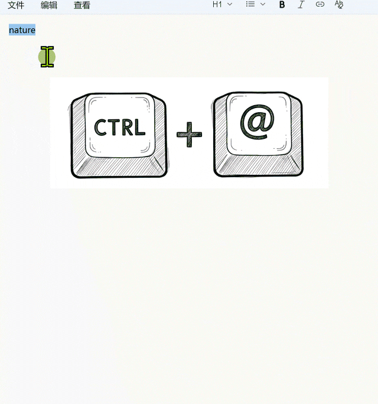

# ImTip 智能桌面助手
 
<a href="https://imtip.aardio.com/update/ImTip.7z">点这里下载 ImTip</a> - 免费开源，仅 860 KB。独立 EXE 无任何外部依赖，兼容 XP，Vista，Win7，Win8，Win10，Win11 ……  

ImTip 提供 [输入跟踪提示](#一输入跟踪提示)、[超级热键（各种桌面应用快速接入 AI）](#二超级热键)、[自定义 AI 助手](#三-ai-助手) 等功能。

- [超级热键开发指南](https://www.aardio.com/zh-cn/doc/?q=library-guide%2Fstd%2Fkey%2Fhotkey.html)
- [配置输入法状态跟踪提示规则与外观](https://www.aardio.com/zh-cn/doc/?q=library-guide/std/key/ime.stateBar.html)
- [输入法与键盘状态检测原理与规则](https://www.aardio.com/zh-cn/doc/?q=library-guide/std/key/imeState.html)

## 一、输入跟踪提示

输入跟踪提示通过**在输入光标处显示 2 个简洁的图标** —— 提前知道中英、中英标点、全半角、大小写、多语言键盘布局等所有状态。


可以方便地自定义外观方案，例如[单图标方案](https://imtip.aardio.com/#dot-scheme)效果如下：


**再也不怕按错了！** 保持思考与输入的连续性，避免低头看任务栏或通过其他操作检查输入状态。


- 不是只能看中英状态，而是关注更少的图标，了解更多的常用输入法与键盘状态。
- 不是只在切换输入法才显示一次状态，当切换到新的输入位置都会及时地提醒输入法状态，可以自定义显示时长、方式、外观。
<br>


有了 ImTip 就可以关掉输入法自带的状态栏，屏幕更干净了，**美滋滋再也不用看右下角** ！


理论上支持所有输入法，系统自带的微软拼音，微软五笔，小小输入法，搜狗输入法，百度输入法，QQ输入法，谷歌输入法，小鹤输入法，手心输入法 …… 包括我测试的日文、韩文、西班牙语输入法都可以支持 ImTip 。

ImTip 支持可视化编辑状态提示外观：


可将外观方案直接拖入 ImTip.exe 或外观设置窗口快速导入。  
支持用剪贴板直接复制粘贴配置方案代码。  


ImTip **CPU 占用极低**，可以通过设置「跟踪检测速度」调整 CPU 占用：


默认有微小延迟 —— 这是程序的主动优化( 并非被动延迟 )，您可以加快「跟踪检测速度」（更丝滑，增加的资源占用仍然是可忽略的）。

## 二、超级热键

ImTip 提供可编程扩展的「超级热键」。

默认提供以下热键：
- <kbd>Ctrl+@</kbd> AI 全局翻译与词典
- <kbd>Ctrl+#</kbd> 快速查单词（汽泡提示）
- <kbd>Ctrl+$</kbd> 打开财务大写、日期时间大写、数学运算工具


更多示例：

超级热键调用 AI 大模型自动编写 aardio 代码（ aardio 现在已自带类似的 F1 键 AI 助手）：


超级热键调调用 AI 大模型在 PowerShell 中写代码


超级热键调调用 AI 大模型在记事本中续写与补全


<kbd>Ctrl+@</kbd> 调用 AI 全局翻译 + 词典



[超级热键大全 | 教程](https://www.aardio.com/zh-cn/doc/?q=library-guide%2Fstd%2Fkey%2Fhotkey.html)

>  AI 翻译与词典需要用到 `string.words`,`table.coca2000` 扩展库，AI 翻译的大声朗读功能需要用到 `web.edgeTextToSpeech` 扩展库。
>  1. 请先在 aardio 在点击「 工具 » 扩展库 」
>  2. 搜索关键词“英语”，勾选找到的 `string.words`,`table.coca2000` 扩展库
>  3. 然后点击 「安装」 按钮
>  
>  如果 aardio 已运行并且当前线程调用了 `import ide` 则支持自动安装扩展库

## 三、 AI 助手

ImTip 提供简洁可定制的 AI 桌面助手。
可迅速将大模型 API 转换为可用的桌面助手。AI 助手已支持渲染数学公式、代码高亮、一键分享截长屏、自动联网读取文档 …… 等功能。

可自定义多个 AI 助手配置，同一会话也可以随时切换不同的大模型。新版 ImTip 已经默认添加了翻译、词典等 AI 助手。


ImTip 也支持在超级热键中快助调用 AI 大模型接口，或者自动调用 AI 会话窗口。启用步骤如下：
1. 在 ImTip 主界面勾选启用超级热键。
2. 后点击『编辑超级热键』，在超级热键配置中修改 AI 接口参数。
  
3. 点击保存按钮后热键自动生效。  


## 托盘菜单

ImTip 托盘菜单提供快捷启用系统输入法、切换双拼方案等功能。


ImTip 快捷键：

按住 <kbd>Shift</kbd> 点击托盘图标可打开 AI 助手。  
接住 <kbd>Ctrl</kbd> 点击托盘图标可启用/禁用输入跟踪提示。

输入法常用快捷键:  
<kbd>Shift</kbd> 切换中/英输入；  
<kbd>Ctrl+.</kbd> 换中/英标点；  
<kbd>Shift+空格</kbd> 切换全/半角；  
<kbd>Alt+Shift</kbd> 切换语言  

## 常见问题

### 1. 关于英文键盘

有些第三方输入法会安装「中文美式键盘」 - 可能导致不必要的错乱。这个键盘在 Win10 其实已被废弃，建议移除或更改为「英语美式键盘」。Win7/Win10/Win11 可在 ImTip 托盘菜单中禁用启用一次「英语键盘」就可修复该问题。

### 2. 管理权限窗口

ImTip 默认以普通权限启动，以管理权限启动 ImTip.exe —— 才会对其他管理权限窗口生效。以管理权限启动后重新勾选 「允许开机启动」，则开机以管理权限启动（ 不会再弹出请求权限弹框 , 注意只有同样在管理权限下启动才能取消此设置 ）。

### 3. 窗口兼容性 

ImTip 使用了多种不同的接口获取输入位置，但少数任何接口都不支持的应用窗口会退化为取鼠标输入指针位置。

在设置界面勾选『启用 java.accessBridge 扩展 』可自动支持 JetBrains 等 Java 程序窗口，一键自动启用，不需要其他手动配置与操作。

如果勾选『启用 java.accessBridge 扩展』时自动取消，并且显示 『未启用 java.accessBridge 扩展 』，请检查当前系统是否能正常联网( 此功能需要下载 aardio 扩展库 java.accessBridge  )。也可以自行下载 aardio 最新版，然后在 aardio 中运行下面的代码启用 JAB( Java Access Bridge  ) :

```aardio
import java.accessBridge;
print( java.accessBridge.switch(true) );
```

对于以上方式都不支持的窗口，请参考：[设置兼容窗口类名](https://www.aardio.com/zh-cn/doc/library-guide/std/key/ime.stateBar.html#editorClasses")

微信 4.0 已经完美支持 ImTip，不需要其他设置。

> ImTip 仅在检测到输入框时显示输入状态。即使取消勾选「仅切换输入目标或状态后显示」，在检测不到输入目标的窗口仍然不会显示输入状态（除非所在窗口设置了兼容窗口类名）。

### 4. 输入法兼容性

请参考：[输入法与键备状态检测原理与规则](https://www.aardio.com/zh-cn/doc/?q=library-guide/std/key/imeState.html)

- 主流输入法基本都可以支持 ImTip 。 

- 微软自带的所有输入法完美支持 ImTip。

- 小小输入法完美支持  ImTip。如有问题可使用开源工具 [IMY](https://github.com/aardio/IMY) 卸载重装一次小小输入法就可以了。

- 小狼毫输入法请安装最新 [nightly build](https://github.com/rime/weasel/releases/tag/latest) 版可支持 ImTip ，可通过 ImTip 托盘菜单启用或禁用输入法悬浮提示

- 微信输入法、手心输入法、讯飞输入法需要勾选『怪异模式』。注意这三种输入法分别使用不同的『怪异模式』，最好不要同时安装这些有问题的输入法，安装变动后也请重新勾选一次『怪异模式』以更新配置。勾选『怪异模式』则不支持其他正常输入法。

- 小鹤输入法在英文模式下切换全半角后状态会错乱，按 Shift 切换一次中英模式会恢复正常，可能基于多多的输入法都有类似问题。

- 个别老旧的输入法会导致其他输入法的状态也变得混乱，卸载有问题的输入法，切换或重新打开窗口可恢复正常。

### 5. 启动参数

- `ImTip.exe *.aardio`
加载配置方案，或者直接将配置文件拖到 ImTip.exe 上也可以。

- `ImTip.exe 无参数`
如果 ImTip 已运行则打开配置窗口，或者直接双击 ImTip.exe 也可以。

- `ImTip.exe /chat 配置名称 /q 需要立即发送的问题`
启动 AI 聊天助手会话窗口。配置名称可省略，q 参数也可以省略。
aardio 提供 process.imTip 库可以方便地启动 ImTip 聊天助手，可参考：[超级热键 - 自动调用 AI 会话窗口](https://www.aardio.com/zh-cn/doc/library-guide/std/key/hotkey.html#imtip-ai-chat)。 

- `ImTip.exe /sys`
启动时不显示主界面。勾选开机启动时设置的这是这个参数。

### 6. 删除或重置 ImTip 配置与数据。

先退出 ImTip ，然后按 <kbd>Ctrl+R</kbd>打开「运行」，
输入   
`cmd /c rd /s /q  %localappdata%\aardio\std\ImTip`   
回车执行即可删除配置目录( 也会删除超级热键配置 )。

重新运行 ImTip 会自动重置到最新版的默认配置。  

****

本页的动画主要使用 [开源免费，下载体积仅 820 KB 的极简录屏软件 Gif123](https://gif123.aardio.com/) 录制。
