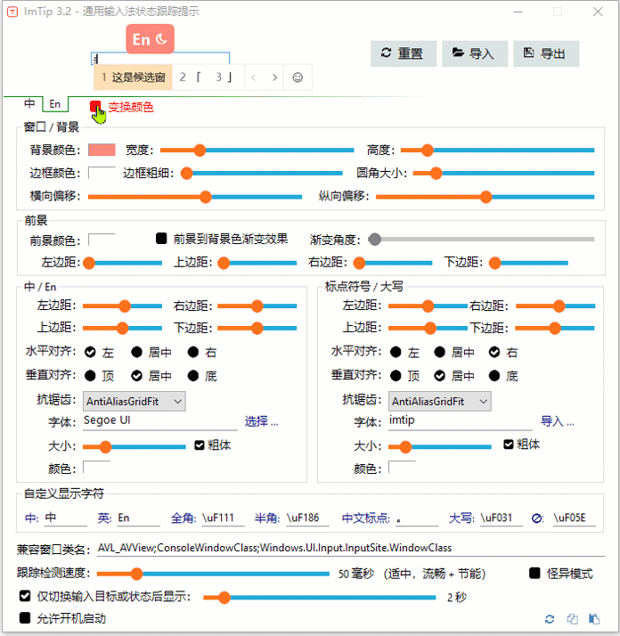
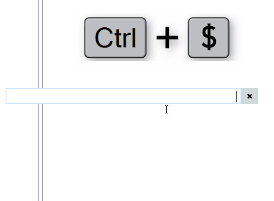
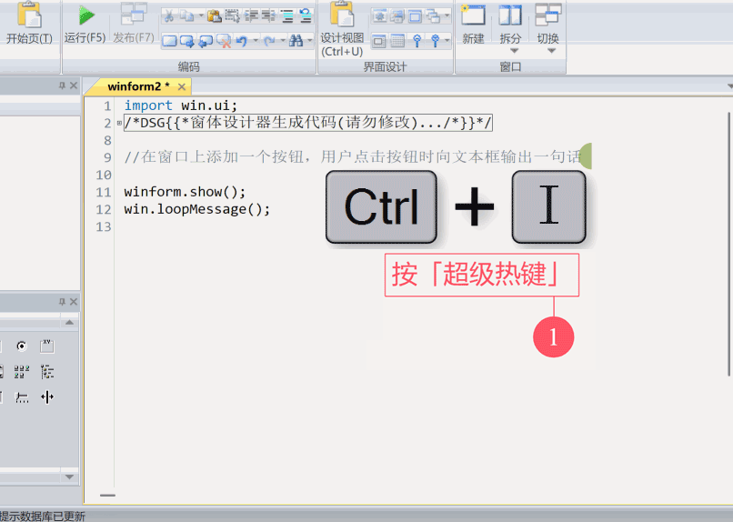
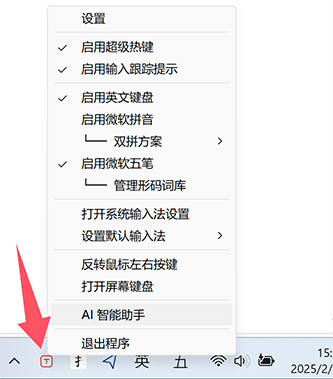
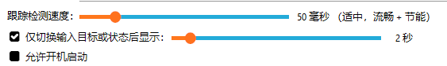

# ImTip 桌面助手
 
<a href="https://imtip.aardio.com/update/ImTip.7z">点这里下载 ImTip</a> - 免费开源，仅 799 KB。独立 EXE 无任何外部依赖，兼容 XP，Vista，Win7，Win8，Win10，Win11 …… 等所有流行桌面操作系统。  

ImTip 提供超级热键、输入法状态提示、自定义 AI 助手等功能。

- [超级热键开发指南](https://www.aardio.com/zh-cn/doc/?q=library-guide%2Fstd%2Fkey%2Fhotkey.html)
- [配置输入法状态跟踪提示规则与外观](https://www.aardio.com/zh-cn/doc/?q=library-guide/std/key/ime.stateBar.html)

输入法提示通过**在输入光标处显示 2 个简洁的图标** —— 提前知道中英、中英标点、全半角、大小写、多语言键盘布局等所有状态。

可以方便地自定义外观方案，例如[单图标方案](https://imtip.aardio.com/#dot-scheme)效果如下：

**再也不怕按错了！** 保持思考与输入的连续性，避免低头看任务栏或通过其他操作检查输入状态。

- 不是只能看中英状态，而是关注更少的图标，了解更多的常用输入法与键盘状态。
- 不是只在切换输入法才显示一次状态，当切换到新的输入位置都会及时地提醒输入法状态，可以自定义显示时长、方式、外观。
 

有了 ImTip 就可以关掉输入法自带的状态栏，屏幕更干净了，**美滋滋再也不用看右下角** ！

理论上支持所有输入法，系统自带的微软拼音，微软五笔，搜狗输入法，小小输入法，百度输入法，QQ输入法，谷歌输入法，小鹤输入法，手心输入法 …… 包括我测试的日文、韩文、西班牙语输入法都可以支持 ImTip 。

ImTip 支持可视化编辑状态提示外观：

可将外观方案直接拖入 ImTip.exe 或外观设置窗口快速导入。  
支持用剪贴板直接复制粘贴配置方案代码。  

ImTip 提供可编程扩展的「超级热键」。
例如按 Ctrl+$ 打开财务大写、日期时间大写、数学运算工具：

超级热键调用 AI 大模型自动编写 aardio 代码：

[超级热键大全](https://www.aardio.com/zh-cn/doc/?q=library-guide%2Fstd%2Fkey%2Fhotkey.html)

ImTip 托盘菜单提供快捷启用系统输入法、切换双拼方案等功能。

ImTip **CPU 占用极低**，可以通过设置「跟踪检测速度」调整 CPU 占用：

默认有微小延迟 —— 这是程序的主动优化( 并非被动延迟 )，您可以加快「跟踪检测速度」（更丝滑，增加的资源占用仍然是可忽略的）。

**附：输入法常用快捷键**  
「Shift」切换中/英输入；  
「Ctrl + . 」切换中/英标点；  
「Shift + 空格 」切换全/半角；  
「Alt + Shift」切换语言  

## 常见问题

一、关于英文键盘

有些第三方输入法会安装「中文美式键盘」 - 可能导致不必要的错乱。这个键盘在 Win10 其实已被废弃，建议移除或更改为「英语美式键盘」。Win7/Win10/Win11 可在 ImTip 托盘菜单中禁用启用一次「英语键盘」就可修复该问题。

二、管理权限窗口

ImTip 默认以普通权限启动，以管理权限启动 ImTip.exe —— 才会对其他管理权限窗口生效。以管理权限启动后重新勾选 「允许开机启动」，则开机以管理权限启动（ 不会再弹出请求权限弹框 , 注意只有同样在管理权限下启动才能取消此设置 ）。

三、窗口兼容性 

ImTip 使用了多种不同的接口获取输入位置，但少数任何接口都不支持的应用窗口会退化为取鼠标输入指针位置。

对于以上方式都不支持的窗口，可在『兼容窗口类名』中添加窗口类名（可使用 aardio 工具中的窗口探测软件查看），多个类名以分号分开。兼容类名写法规则如下：

- 如果兼容类名前面增加 `#` 字符则表示该窗口是一个较小的文本输入框，例如 `#EXCEL6`。
- 如果兼容类名前面增加 `@` 字符则表示则通过 MSAA 接口获取输入框位置，典型的例如微信 3.x 可指定兼容类名为 `;@WeChatMainWndForPC`。 
- 发果兼容类名前没有 `#` 或 `@` 字符，则直接获取鼠标指针位置以显示输入状态提示。

微信 4.0 已经完美支持 ImTip，不需要设置。

> ImTip 仅在检测到输入框时显示输入状态。即使取消勾选「仅切换输入目标或状态后显示」，在检测不到输入目标的窗口仍然不会显示输入状态（除非所在窗口设置了兼容窗口类名）。

四、输入法兼容性

请参考：[输入法与键备状态检测原理与规则](https://www.aardio.com/zh-cn/doc/?q=library-guide/std/key/imeState.html)

主流输入法基本都可以支持 ImTip 。 

微信输入法、手心输入法、讯飞输入法需要勾选『怪异模式』，勾选『怪异模式』以后不支持其他正常输入法。

小小输入法需要注册 TSF 内置组件（这是默认选项）。小小输入法返回的语言代码受系统设置的区域格式影响，如果区域格式不是中文，请到设置中修改为中文，并重新新注册一次 TSF 组件即可正常识别状态。

小鹤输入法有一个小问题，在英文模式下切换全半角后状态会错乱，按 Shift 切换一次中英模式会恢复正常，可能基于多多的输入法都有类似问题。 

五、启动参数

ImTip.exe *.aardio
加载配置方案，或者直接将配置文件拖到 ImTip.exe 上也可以。

ImTip.exe 无参数
如果 ImTip 已运行则打开配置窗口，或者直接双击 ImTip.exe 也可以。

ImTip.exe /chat 配置名称 /q 需要立即发送的问题
启动 AI 聊天助手会话窗口。配置名称可省略，q 参数也可以省略。
aardio 提供 process.imTip 库可以方便地启动 ImTip 聊天助手，可参考：[超级热键 - 自动调用 AI 会话窗口](https://www.aardio.com/zh-cn/doc/library-guide/std/key/hotkey.html#imtip-ai-chat)。 

六、提示窗口闪烁

ImTip 默认会阻止重复运行，但如果您在 aardio 开发环境中单独运行创建提示窗口的源码，并且同时创建了多个输入法提示窗口，多个窗口相互冲突当然就会闪烁了。

****

本页的动画主要使用 [开源免费，下载体积仅 820 KB 的极简录屏软件 Gif123](https://gif123.aardio.com/) 录制。
