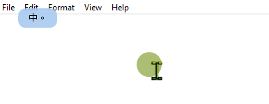
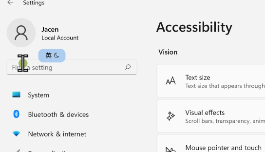
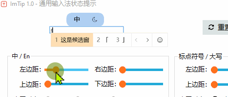
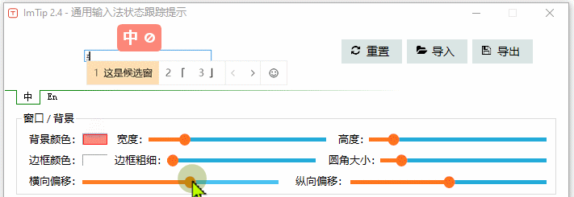

# ImTip ( 通用输入法状态跟踪提示 )
 
<a href="https://imtip.aardio.com/update/ImTip.7z">点这里下载 ImTip</a>。   
免费开源，仅 563 KB。单文件绿色软件，无任何外部依赖，兼容 XP，Vista，Win7，Win8，Win10，Win11 …… 等所有流行桌面操作系统。  

1、仅用两个字符就可提示中英、全半角、大小写、中英标点、多语言键盘布局等所有状态。

美滋滋再也不用低头看右下角了！

理论上支持所有输入法，系统自带的微软拼音，微软五笔，搜狗拼音，百度输入法，QQ输入法 …… 包括我测试的日文、韩文、西班牙语输入法都可用。个别有问题的输入法可尝试勾选配置中的「怪异模式」修正。

2、支持多语言键盘：

3、能获取输入框光标、或鼠标输入光标位置实时显示输入法状态，广泛兼容几乎所有窗口。

支持 UWP 窗口

4、仅切换状态时显示数秒（可自定义），无输入框窗口不显示。

5、可视化编辑外观，提供了丰富的设置选项。

调整文字/图标布局：  

调整提示窗口偏移位置： 

6、可导入、导出外观方案，导出的外观方案既可以重新导入 ImTip，也是一个完整软件的 aardio 源代码（可以单独生成 EXE）。可以将外观方案直接拖入 ImTip.exe 加载，也可以直接拖进 ImTip 外观设置界面加载。

支持用剪贴板直接复制粘贴配置方案代码：

7、支持自定义图标字体（*.ttf 格式，可以将 *.ttf 直接拖入 ImTip 设置界面，导出外观方案时也会自动嵌入图标字体）。可自定义所有图标字符。可直接复制粘贴 16进制或 NCR 字符编码，也可以点击字符前面的标题，打开文字图标预览窗口点选图标。
​
导入图标字体：

注意点击字符编辑框预览该字符显示效果，点击字符前的标题打开图标浏览器。

在线制作或下载字体图标：  
https://fontello.com   
https://iconfont.cn  

8、提供可编程扩展的「超级热键」功能。

例如按 Ctrl + $ 输入大写中文数字的中文日期：

9、托盘菜单提供快捷启用、禁用系统输入法、切换双拼方案等功能。

适用 Win10/ Win11 以及之后的系统自带的微软输入法，即使系统未安装小鹤双拼方案，仍然可以一键启用。

10、 CPU 占用极低

ImTip 正常工作是基本为休眠状态，基本不占 CPU 和内存。
我在 Win7, Win10, Win11 测试 CPU 占用基本保持为 0 ，内存占用没超过 10 MB。设置样式的窗口 —— 为了尽量让大家用得舒服，控件和功能略多。但这个功能并不需要经常使用，关闭设置窗口后会立即释放内存。

可以通过设置「跟踪检测速度」调整 CPU 占用：

