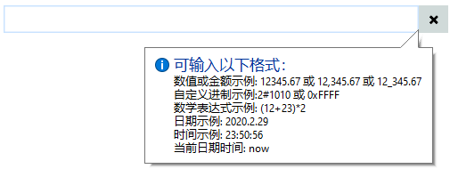

# ImTip ( 通用输入法状态跟踪提示 )
 
<a href="https://imtip.aardio.com/update/ImTip.7z">点这里下载 ImTip</a> - 免费开源，仅 595 KB。单文件绿色软件，无任何外部依赖，兼容 XP，Vista，Win7，Win8，Win10，Win11 …… 等所有流行桌面操作系统。  

1、仅用两个字符就可提示中英、全半角、大小写、中英标点、多语言键盘布局等所有状态。


结合输入法快捷键：「Shift」中/英；「Ctrl + . 」中/英标点；「Shift + 空格 」全/半角，美滋滋再也不用低头看右下角了！理论上支持所有输入法，系统自带的微软拼音，微软五笔，搜狗输入法（请务必安装搜狗最新版），百度输入法，QQ输入法 …… 包括我测试的日文、韩文、西班牙语输入法都可用。注意：手心输入法需要勾选「怪异模式」。

2、支持多语言键盘：


可按快捷键 Alt + Shift 切换多语言键盘。注意有些第三方输入法会安装「中文美式键盘」 - 可能导致不必要的错乱。这个键盘在 Win10 其实已被废弃，建议移除或更改为「英语美式键盘」。Win7/Win10/Win11 可在 ImTip 托盘菜单中禁用启用一次「英语键盘」就可修复该问题。   

3、默认仅切换输入目标或状态时显示数秒（可自定义），无输入框窗口不显示，广泛兼容几乎所有窗口。  


支持 UWP 窗口


有少数无法获取输入光标的窗口会退化为检测并跟踪鼠标“I”型文本指针，有少数窗口什么也检测不到 —— 可尝试将类名添加到「窗口兼容类名」。 个别输入法在某个特定的窗口偶尔会状态错乱（或导致其他输入法错乱），切换到其他窗口（或重新打开原窗口）可恢复正常。 另外请注意 ImTip 默认以普通权限启动，以管理权限启动 ImTip.exe —— 才会对其他管理权限窗口生效，以管理权限启动后重新勾选 「允许开机启动」，则开机以管理权限启动（ 不会再出现请求权限弹框 ）。    

4、可视化编辑外观，提供了丰富的设置选项。


调整文字/图标布局：  


调整提示窗口偏移位置： 


5、可导入、导出外观方案。
可将外观方案直接拖入 ImTip.exe 或外观设置窗口快速导入

支持用剪贴板直接复制粘贴配置方案代码：


神奇的是：ImTip 导出的配置方案文件就是一个软件的完整源代码，可用 aardio  一键生成独立 EXE 文件。

6、支持自定义图标字体。

可以将 *.ttf 格式图标字体直接拖入 ImTip 设置界面，导出配置方案时也会自动嵌入图标字体。


点击字符代码编辑框（可粘贴 16进制或 NCR 编码）前面的标题，即可打开文字图标浏览窗口，点选需要的图标即可实时预览效果。

在线制作或下载字体图标：  
https://fontello.com   
https://iconfont.cn  

7、提供可编程扩展的「超级热键」功能。

例如按 Ctrl+$ 打开财务大写、日期时间大写、数学运算工具：


自动检测输入数值的格式，输入错误格式会显示格式说明：



超级热键示例，按大写键自动切换到英文输入：
```javascript
["CAPSLK"]  = function(){  
    key.ime.setOpenStatus(false);
    key.ime.setConversionMode(0); 
    
    return true; //允许按键继续发送
};
```

8、托盘菜单提供快捷启用系统输入法、切换双拼方案等功能。


适用 Win10/ Win11 以及之后的系统自带的微软输入法，即使系统未安装小鹤双拼方案，仍然可以一键启用。

9、 CPU 占用极低

ImTip 正常工作时基本为休眠状态，基本不占 CPU 和内存。
我在 Win7, Win10, Win11 测试 CPU 占用基本保持为 0 ，内存占用没超过 10 MB。设置样式的窗口 —— 为了尽量让大家用得舒服，控件和功能略多。但这个功能并不需要经常使用，关闭设置窗口后会立即释放内存。

可以通过设置「跟踪检测速度」调整 CPU 占用：


默认有微小延迟 —— 这是程序的主动优化( 并非被动延迟 )，您可以加快「跟踪检测速度」（更快地实时跟随光标，更小延迟），这增加的资源占用仍然是可忽略的。

****

上面的动画使用 [开源免费，下载体积仅 820 KB 的极简录屏软件 Gif123](https://gif123.aardio.com/) 录制。
